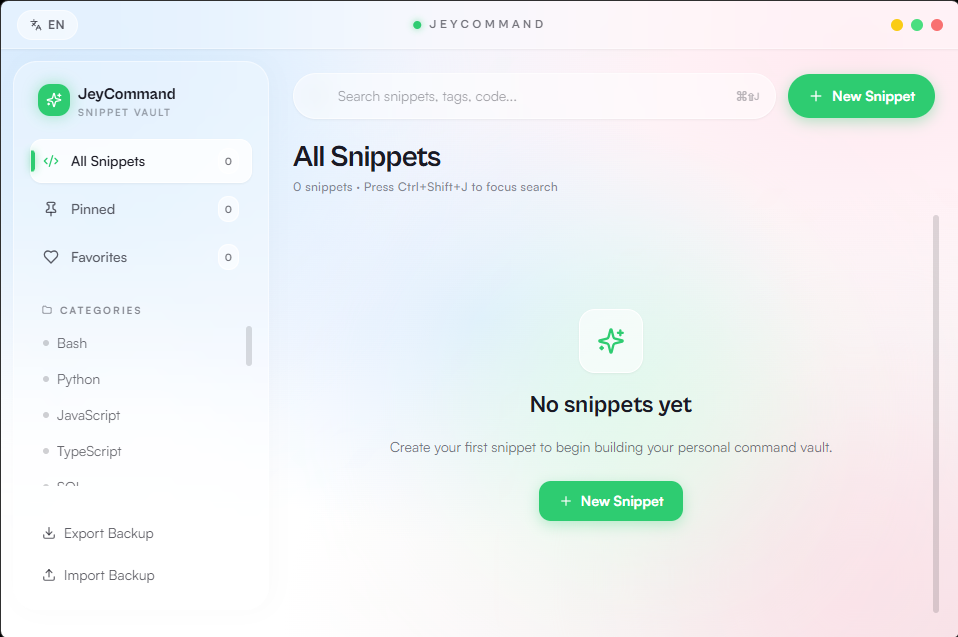

# JeyCommand 🚀

**JeyCommand** is a modern, developer-centric, and ultra-fast snippet manager designed for quick storage, organization, and retrieval of command-line tools, terminal scripts, and code snippets. Built carefully with Tauri, React, TypeScript, and Tailwind CSS, it offers an optimal desktop experience across Windows, macOS, and Linux.

[English](#english) | [فارسی](#فارسی)

---

## English

### 🌟 Introduction
As developers, we constantly run complex terminal commands, configuration scripts, and small utility code blocks. Keeping track of them or digging through history files can slow down your workflow. **JeyCommand** provides an elegant, completely local desktop environment to categorize, search, and access your most important snippets instantly.

### 📸 Preview

### ✨ Key Features
- **Multi-language Support (i18n)**: Seamlessly switch between English (LTR) and Persian (RTL) layouts with a single click.
- **Offline Language Detection**: Automatically analyzes and detects code types (e.g., distinguishing between a Linux Bash command and a Python script) completely offline.
- **IDE-Grade Syntax Highlighting**: Visualizes code with rich text coloring for variables, comments, and strings to guarantee high readability.
- **Advanced Multi-Tagging System**: Organizes snippets by structural tags (Bash, SQL, Python) as well as operational labels (e.g., `Server`, `Security`, `Urgent`).
- **Quick Clipboard Copy**: Minimalist one-click copy button next to every snippet for immediate deployment.
- **Native File Backup**: Securely exports and imports your entire library as a clean JSON file via Tauri's native OS file dialogs.

---

## فارسی

برنامه **JeyCommand** یک ابزار مدرن، مینیمال و بسیار سریع برای مدیریت و دسترسی فوری به دستورات ترمینال، اسکریپت‌های شل (Shell Scripts) و تکه کدهای مختلف (Snippets) است که با ساختاری کاملاً آفلاین و امن برای سیستم‌عامل‌های ویندوز، مک و لینوکس طراحی شده است.

### 🌟 معرفی برنامه
بسیاری از برنامه‌نویسان روزانه با ده‌ها دستور پیچیده ترمینال، کدهای فیکس زیرساخت یا اسکریپت‌های تکراری سر و کار دارند. جستجو در تاریخچه ترمینال یا نوت‌بوک‌ها زمان‌بر است. **JeyCommand** با یک واسط کاربری متمرکز و بسیار سریع به شما اجازه می‌دهد تا تمام این دستورات و کدهای حیاتی را در یک محیط کاملاً فلت، مدرن و لوکال ذخیره کرده و در کسری از ثانیه به آن‌ها دسترسی داشته باشید.

### ✨ قابلیت‌های اصلی برنامه
- **پشتیبانی کامل از دو زبان**: امکان تغییر آنی و کامل چیدمان و متن‌های برنامه بین انگلیسی (LTR) و فارسی (RTL).
- **تشخیص خودکار و آفلاین زبان کدهای کپی شده**: سیستم هوشمند داخلی برای تشخیص نوع اسکریپت یا زبان برنامه‌نویسی بدون نیاز به اینترنت.
- **رنگ‌آمیزی هوشمند کدها (Syntax Highlighting)**: نمایش کلمات کلیدی، کامنت‌ها و متغیرها دقیقاً مانند یک IDE کوچک برای افزایش خوانایی.
- **سیستم دسته‌بندی و تگ‌گذاری پیشرفته**: امکان فیلتر بر اساس زبان/سیستم‌عامل و اعمال تگ‌های کاستوم و منعطف (مانند: `سرویس‌دهنده`، `امنیت`، `فوری`).
- **کپی سریع (Quick Copy)**: دسترسی آنی به کپی متن اسکریپت در کلیپ‌بورد سیستم تنها با یک کلیک.
- **پشتیبان‌گیری بومی و امن**: قابلیت خروجی گرفتن و بازگردانی فایل‌های بکاپ به صورت JSON کاملاً سازگار با معماری بومی دسکتاپ.

---
*Developed under JeyBox Brand.*
